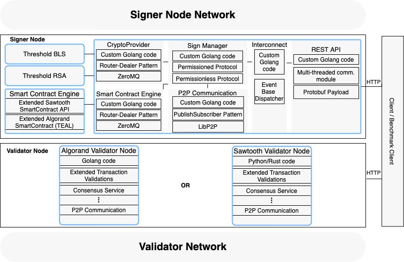

# Decentralizing Trust with Resilient Group Signatures in Blockchains

The porpose of this repository is to host sublinks and explain the porpouse of each git repository for each component of the prorotype for the MSc. The main goal of the thesis [[1](#thesis)] was to create agnostic component able to descentralise conventional digital signatures in blockchains or other distributed systems.

## Context

Blockchains were first introduced by Bitcoin with the goal of promoting the decentralization of cryptocurrency transactions in a P2P-based internetworking model that does not depend on centralized trust parties. Along with research on better scalability, performance, consistency control, and security guarantees in their service planes, other challenges aimed at better trust decentralization and fairness models for blockchains are on the research community’s agenda today.

Asymmetric cryptography and especially digital signatures are key components of blockchain systems. As a common flaw in different blockchains, public keys and verification of single-signed transactions are handled under the principle of trust centralization. In this dissertation, we propose a better fairness and trust decentralization model by prototyping a service plane for blockchains that provides support for collective digital signatures and allows transactions to be collaboratively authenticated and verified with witnessed guarantees. This will be achieved by using resilient group-oriented signatures from randomly and dynamically assigned groups. Our solution will be based on Threshold-Byzantine Fault Tolerant Digital Signatures to improve the global resilience and robustness of blockchain systems while preserving their decentralization nature.

To this end, we will design and implement a modular and portable cryptographic provider that supports cryptographic operations that can be expressed and executed by smart contracts. Our system will be designed to be agnostic and adaptable to dfferent service planes and different blockchains (independent of consensus and consistency control solutions and will be adaptable to permissionless or permissioned models). Therefore, we envision our solution as a portable and adaptable plugin service plane for blockchains that provides authenticated group-signed transactions with decentralized auditing, fairness, and long-term security guarantees to leverage a better trust-based decentralized model. For validation and experimental evaluation of the deployed solution, we will observe the benefits of our proposal, which must do without sacrificing throughput and latency conditions for each blockchain without degrading these metrics compared to using single digital signatures under centralized trust model assumptions. We will perform our validations in a cloud-based testbench pilot, running our service plane in two different blockchains using at least twenty blockchain nodes distributed in three different data

## Architecture
The following Figure illustrates the architecture of the prototype:

Our prototype is built in different components and layers:

- The [signer node](https://github.com/jffp113/SignerNode_Thesis) is the main component, which consists of small components: 
    - The [crypto-provider](https://github.com/jffp113/CryptoProviderSDK), is a self-containerized sub-component where all cryptographic operations take place.
    - The smart-contract engine, which is divided into two engines also housed in Docker containers: one for Algorand smart contracts and one for [Hyperledger Sawtooth Smart-Contracts](https://github.com/jffp113/sawtooth-smartcontract).
- A validator node corresponds to a particular node of the blockchain platform. We have changed two completely different blockchain platforms:
    - [ Algorand ](https://github.com/jffp113/go-algorand)
    - [Hyperledger Sawtooth](https://github.com/jffp113/sawtooth-core)
- Not shown in this figure, but we also have a [Benchmark Client](https://github.com/jffp113/Thesis_Client) and we have adapted the [Algorand SDK](https://github.com/jffp113/go-algorand-sdk) to our needs.

- We also have a [util](https://github.com/jffp113/go-util) with code that is shared across components and sub-components, such as, the Router-Dealer pattern and an algorithm to produce all possible combinations for a certain problem-

### Links to each component
This repository was created with the purpose of aggregating the various components that make up my thesis.

* Signer Node - https://github.com/jffp113/SignerNode_Thesis
* Go CryptoProviderSDK - https://github.com/jffp113/CryptoProviderSDK
* Sawtooth Validator - https://github.com/jffp113/sawtooth-core
* Sawtooth SmartContract - https://github.com/jffp113/sawtooth-smartcontract
* Util - https://github.com/jffp113/go-util
* algorand sdk - https://github.com/jffp113/go-algorand-sdk
* algorand validator - https://github.com/jffp113/go-algorand
* Blockchain Benchmarker - https://github.com/jffp113/Thesis_Client

The latex for the thesis can be found here: https://github.com/jffp113/JPereira_Thesis

## Pre-requisites
Because our project is containerized we have only few dependencies necessary:

It is recommended the prototype is tested on Linux environments, as no tests were done for Windows/MacOS systems and its behaviour and dependencies may be unpredictable on said platforms.

- make - to use the makefile provided in the signer node, however its not mandatory.
- Docker version >= 20.10.6
- docker-compose version >= 1.29.1

Currently docker-compose is integrated with Docker cli tool, but we haven't tested.

## Reference
<a name="thesis">1.</a> J. Pereira. Decentralizing Trust with Resilient Group Signatures in Blockchains, MSc Thesis. Universidade Nova de Lisboa, 2021.
